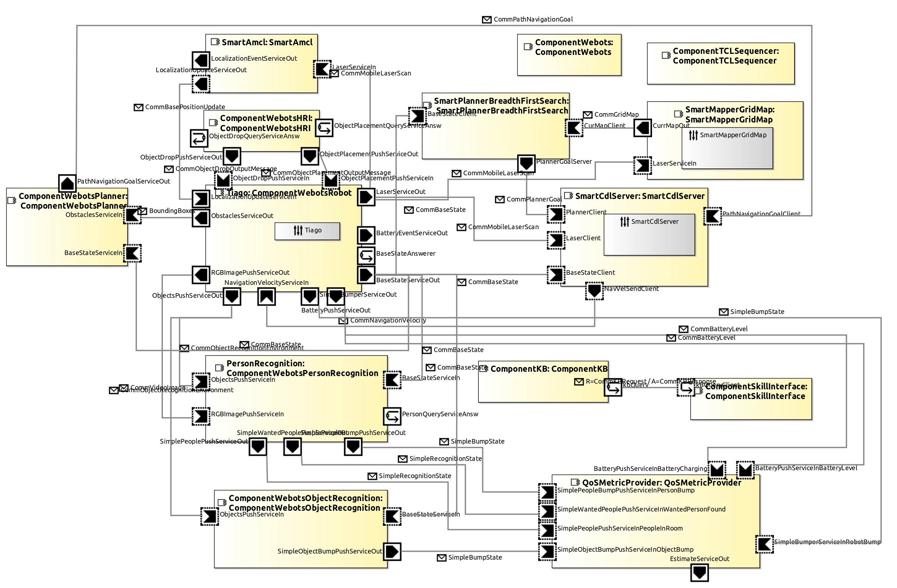

# SystemWebotsTiagoNavigationMiron

System to test MiRON Engine with autonomous navigation and person recognition.

Servicerobotics-Ulm Components:
* [ComponentTCLSequencer](https://github.com/MiRON-project/ComponentRepository/tree/master/ComponentTCLSequencer)
* [ComponentKB](https://github.com/MiRON-project/ComponentRepository/tree/master/ComponentKB)
* [SmartCdlServer](https://github.com/MiRON-project/ComponentRepository/tree/master/SmartCdlServer)
* [SmartMapperGridMap](https://github.com/MiRON-project/ComponentRepository/tree/master/SmartMapperGridMap)
* [SmartPlannerBreadthFirstSearch](https://github.com/MiRON-project/ComponentRepository/tree/master/SmartPlannerBreadthFirstSearch)
* [SmartAmcl](https://github.com/MiRON-project/ComponentRepository/tree/master/SmartAmcl)

AROSYS Components
* [ComponentWebots](https://github.com/MiRON-project/AROSYS-Components/tree/master/ComponentWebots)

MIRON Components
* [ComponentSkillInterface](https://github.com/MiRON-project/MIRON-Components/tree/master/ComponentSkillInterface)
* [ComponentWebotsRobot](https://github.com/MiRON-project/MIRON-Components/tree/master/ComponentWebotsRobot)
* [ComponentWebotsPersonRecognition](https://github.com/MiRON-project/MIRON-Components/tree/master/ComponentWebotsPersonRecognition)

MIRON Behavior:
* [BehaviorNavigationScenario](https://github.com/MiRON-project/MIRON-BehaviorRepository/tree/master/BehaviorNavigationScenario)

MIRON Data:
* [MOOD2Be](https://github.com/MiRON-project/MOOD2Be) (Executor)
* [bundles](https://github.com/MiRON-project/bundles/tree/master/ModelRepository/ABR) (skills and test.xml with tree)
* [ZMQServer](https://github.com/MiRON-project/ZMQServer) (not integrated yet)

MIRON DomainModels:
* [DomainModelsRepositories](https://github.com/MiRON-project/DomainModelsRepositories) (Fork with new models)
